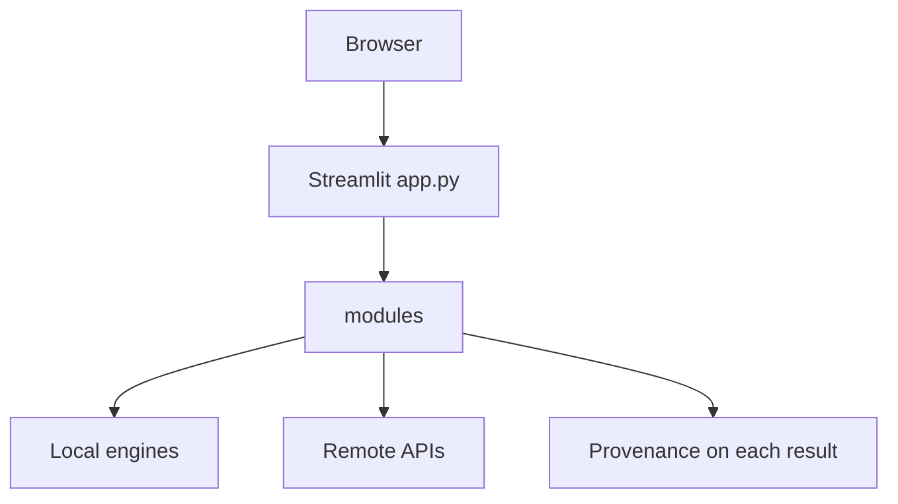

# HelixScope

Scientific workstation for sequence, structure, alignment and phylogenetic
analysis, with an explicit status on every result.

[Documentation](docs/SCIENTIFIC_METHODS.md) ·
[Docker](docs/DOCKER.md) ·
[Scientific methods](docs/SCIENTIFIC_METHODS.md) ·
[Validation](docs/VALIDATION.md) ·
[Security](SECURITY.md) ·
[Citation](CITATION.cff)


## Demo

Public hosted demo: not yet available.

## Highlights

- Local sequence statistics, pairwise alignment and protein chemistry, each labeled `COMPUTED`
- RNA secondary structure from ViennaRNA, labeled `PREDICTED`, and not treated as 3D
- FastTree, IQ-TREE, BLAST+ and US-align in the tested container, or `not_installed` when the binary is absent
- Remote NCBI, RCSB, VEP, ClinVar and EMBL-EBI calls labeled `RETRIEVED`
- Session history that does not rerun an engine when a stored result is opened
- A non-root Linux container with a dynamic `PORT` and a read-only root in Compose

## Why HelixScope

Sequence tools often collapse "retrieved from a database", "computed here" and
"predicted by a model" into one number. HelixScope keeps those states separate,
names the method, and leaves an unavailable engine unavailable.

The interface is Streamlit. The calculations live in Python (`modules/`).
The tested container is Debian Trixie, Python 3.14.3, Streamlit 1.58.0 and
Biopython 1.87.

HelixScope does not predict pathogenicity, does not claim genome-wide CRISPR
specificity, and does not turn a sequence into an experimental 3D structure.

## Overview

HelixScope is for exploratory analysis of a sequence or structure you already
have, or of a record you choose to retrieve. Local calculations run on this
machine. Remote calls go out only when you submit them.

The official entry point is `app.py`. `apps/web` and `services/api` are frozen
migration experiments. They are not the product runtime.

## Capabilities

| Module | What it does | Backend | Limit to keep in mind |
| --- | --- | --- | --- |
| Overview | Session objects and engine detection | Local registry | Detection is not a live validation |
| DNA | Composition, GC, AT, skew, reverse complement, Tm, mass, k-mers, ORFs, CpG | Local Python | Technical cap 200,000 residues after cleaning. Validated linear fixture: 150,000 nt |
| RNA | Composition and ViennaRNA secondary structure | ViennaRNA 2.7.2 in the container | Global fold limited to 600 nt. Local window analysis is not a global fold and is not 3D |
| Protein | Mass, theoretical pI, extinction, charge, Shannon entropy and related indices | Biopython ProtParam | Not a structure prediction |
| Alignment | Global and local pairwise alignment | Needleman-Wunsch and Smith-Waterman, affine gaps | 8,000 residues per sequence. This is not BLAST and not an MSA |
| Motif | Exact motif search in the pasted sequence | Local Python | Not a genome-wide scan |
| CRISPR | Guide tables for declared Cas systems, including SpCas9 / NGG | Local heuristic | Not Doench Rule Set 2, not CFD/MIT genome-wide, not clinical |
| Variant | Variant identity for a stated assembly | Local coordinates; VEP, ClinVar, InterPro and UniProt on request | No pathogenicity score |
| NCBI | Entrez nucleotide, protein, gene and PubMed | NCBI, when you search or fetch | Public rate limit unless `NCBI_API_KEY` is set |
| BLAST | Remote NCBI BLAST, plus local BLAST+ against a tiny fixture in the image | NCBI or local BLAST+ 2.17.0+ | The image does not contain nt or nr |
| MSA | Multiple alignment of a small collection | EMBL-EBI Clustal Omega (`ebi_clustalo`) | An MSA is not a phylogenetic tree |
| Phylogeny | NJ, UPGMA, FastTree and IQ-TREE on a completed alignment | Local distances; FastTree 2.1.11 and IQ-TREE 3.1.3 in the container | Branch support is absent unless that run requested it |
| Structure 3D | Parse mmCIF/PDB and draw coordinates | Local parser and Plotly | An illustrative helix is not experimental coordinates |
| Compare | Pairwise structure alignment | US-align 20260328 locally; RCSB Alignment API remotely | A self-alignment fixture is not a general accuracy claim |
| Scientific Engines | Shows what is installed on this machine | Local detection | `not_installed` stays not installed |

Detail is in [docs/SCIENTIFIC_METHODS.md](docs/SCIENTIFIC_METHODS.md).

## Scientific scope

HelixScope analyzes the sequence or file you provide, within the technical
caps in the table above. It does not assemble genomes, call variants from
reads, or search a complete public assembly unless that assembly was installed
and an engine that can search it is present. In the tested container,
Cas-OFFinder is not installed, so genome-wide off-target search does not run.

## Architecture



Session history stays in `st.session_state`. Cached calculations are keyed by
their inputs. See [docs/ARCHITECTURE.md](docs/ARCHITECTURE.md).

## Data sources

Remote sources are contacted only for the action you start: NCBI Entrez and
ClinVar, Ensembl VEP, InterPro and UniProt, RCSB PDB and its alignment API,
PDB-REDO DSSP, EMBL-EBI Clustal Omega, and AlphaFold DB when a prediction file
is requested. Local engines do not call those services.

See [docs/DATA_SOURCES.md](docs/DATA_SOURCES.md).

## Scientific engines

In the tested container:

| Engine | Version | Role |
| --- | --- | --- |
| FastTree | 2.1.11 | Approximate maximum likelihood |
| IQ-TREE | 3.1.3 | Maximum likelihood |
| BLAST+ | 2.17.0+ | Local search of the tiny fixture databases |
| US-align | 20260328 | Monomer structure alignment |
| ViennaRNA | 2.7.2 | RNA secondary structure |

Not installed in that image: Cas-OFFinder, local DSSP, STRIDE, MSMS and
EDTSurf. PDB-REDO DSSP remains a remote call.

See [docs/ENGINES.md](docs/ENGINES.md) and [docs/THIRD_PARTY.md](docs/THIRD_PARTY.md).

## Provenance and result status

A result carries a status from `modules/provenance.py`. The important
distinctions:

- `RETRIEVED` came from a remote record.
- `COMPUTED` was calculated here from the input.
- `PREDICTED` is a model output, including RNA folding and AlphaFold files.
- `HEURISTIC` is a simplified score, including the CRISPR positional score.
- `EXPERIMENTAL` refers to experimental coordinates, not to a drawing.
- `ILLUSTRATIVE` is a schematic. It is not a biological structure.
- `UNAVAILABLE`, `not_installed` and `RESOURCE_LIMIT` are final. They are not
  rewritten into a number.

Engine checks use a second vocabulary: `detected`, `live_validated`,
`remote_validated` and `broken`. Detected is not live-validated.

See [docs/PROVENANCE.md](docs/PROVENANCE.md) and
[docs/SCIENTIFIC_INTEGRITY.md](docs/SCIENTIFIC_INTEGRITY.md).

## Limitations

- Optional engines that are missing stay missing.
- RNA folding above 600 nt is `RESOURCE_LIMIT`. Local window analysis is not
  a substitute global structure and is not RNA 3D.
- The container BLAST databases are tiny fixtures, not nt or nr. Low-complexity
  queries can return `NO_HITS` under BLAST+ DUST even when a literal match
  exists in the fixture.
- Remote APIs can fail, rate-limit or change. That failure is not local data.
- Streamlit Community Cloud does not run this Docker image.
- The tested container memory limit is 1 GiB. A 512 MB free hosting plan is
  smaller and was not validated as an equivalent runtime.

See [docs/LIMITATIONS.md](docs/LIMITATIONS.md).

## Installation

Python 3.14.3 is the version used in the tested container. From a checkout:

```text
python -m pip install -r requirements.txt
python -m streamlit run app.py --server.port 8501
```

Open http://127.0.0.1:8501 or http://localhost:8501.

`requirements.txt` pins Streamlit 1.58.0, Biopython 1.87, Plotly 6.9.0,
pandas 2.3.3, NumPy 2.5.3, pytest 9.1.1 and Hypothesis 6.168.3. ViennaRNA is
installed by the Docker image (`ViennaRNA==2.7.2`). Without that module, RNA
folding is unavailable rather than approximated.

A local process does not include FastTree, IQ-TREE, BLAST+ or US-align unless
those executables are already on `PATH`.

## Docker

```text
docker compose up --build
```

Compose sets `PORT=8501` and publishes `127.0.0.1:8501`. If `PORT` is absent,
the entrypoint still uses 8501. Another integer, for example `PORT=9000` or
`PORT=10000`, binds that port instead. A non-integer `PORT` stops startup.

Health: `http://127.0.0.1:8501/_stcore/health` when Compose is used.

The container user is `helix` (uid 10001). Compose mounts a read-only root
filesystem, temporary directories for `/tmp` and the home directory, a limit
of 64 processes and 1 GiB of memory.

See [docs/DOCKER.md](docs/DOCKER.md).

## Local development

Configuration names that the code actually reads are listed in
[docs/CONFIGURATION.md](docs/CONFIGURATION.md). Copy `.env.example` only as a
local reminder. Do not commit `.env` or API keys.

`scripts/start-helixscope.ps1` starts the frozen FastAPI and Next.js stack.
Do not use it as the HelixScope launcher.

## Testing

```text
python -m pytest tests --ignore=tests/api -q
```

A clean clone of the published `main` tree, without the optional engines,
reported 1200 passed, 25 skipped and 0 failed on 2026-10-04. Those skips are
engines and remote calls that are absent in that environment. Earlier runs
inside the tested container, which includes ViennaRNA and the local engines,
reported 1216 passed with 8 skipped and 1215 passed with 9 skipped, both with
0 failed. Those container counts were not repeated on the published commit.
None of the counts is a coverage percentage.

`tests/api` targets the retired API and is not part of that command.

See [docs/TESTING.md](docs/TESTING.md), [docs/VALIDATION.md](docs/VALIDATION.md),
and [docs/CI.md](docs/CI.md).

## Reproducibility

The container is reproducible within the declared image: pinned Python
packages, checksums for the engine downloads, and a recorded base-image
digest. Debian security updates are whatever the Trixie repositories offer
at build time. Remote APIs are not bit-reproducible.

See [docs/REPRODUCIBILITY.md](docs/REPRODUCIBILITY.md).

## Security

Do not put tokens in the tree or the image. Report a vulnerability through a
private GitHub security advisory after the repository is published. There is
no separate security mailbox.

See [SECURITY.md](SECURITY.md).

## Citation

Software citation metadata is in [CITATION.cff](CITATION.cff). The version to
cite is `0.24.3-19`.

## License

HelixScope is released under the MIT license. See [LICENSE](LICENSE).
Third-party engines and databases keep their own terms. See
[docs/THIRD_PARTY.md](docs/THIRD_PARTY.md).

## Project status

Version `0.24.3-19`, from `modules/provenance.py`.

Active development. The Streamlit workstation and the Linux container are the
maintained runtime. This repository is not a deployed production service, and
the frozen Next.js and FastAPI tree is not the product.

Changes that are safe to describe are listed in [CHANGELOG.md](CHANGELOG.md).
